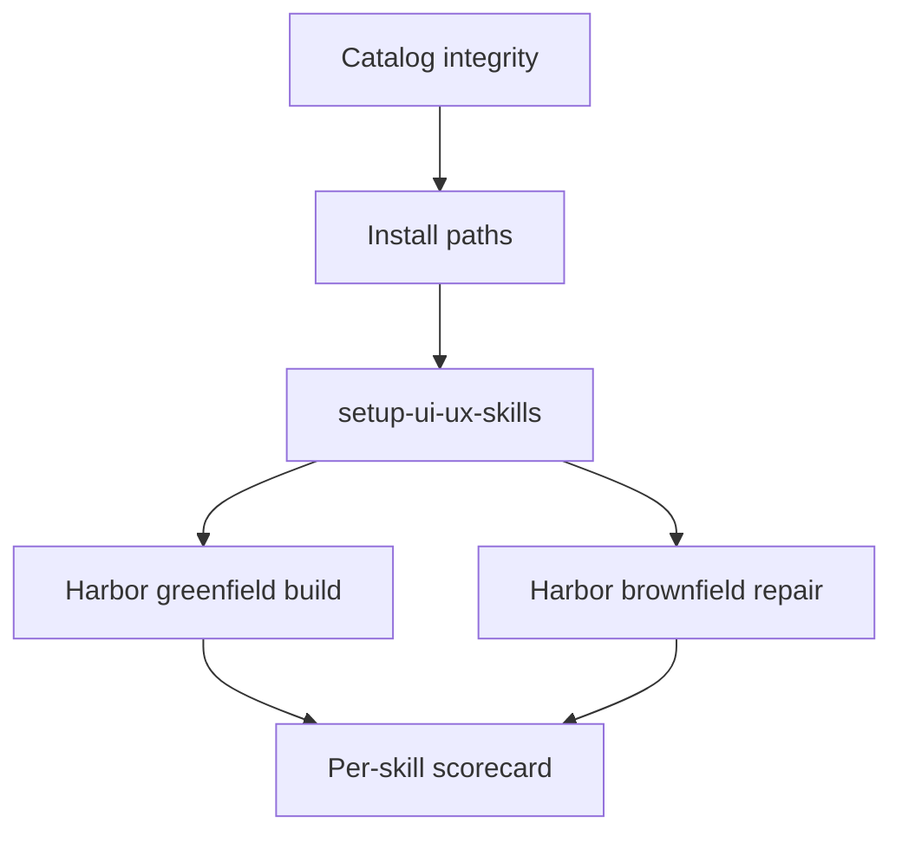

# UX Skills — Full Test Plan

Eval protocol for the VectorLab UI/UX skills catalog (**19 skills**: 1 setup + 1 audit + 17 domain). Success means an agent can **install**, **configure**, and **apply** the skills — not only that the markdown files exist.

Soft taste/heuristics are notes only. Hard rules from each `SKILL.md` are pass/fail.

## Harness

| Item | Location | Git |
| --- | --- | --- |
| This protocol | `tests/TEST-PLAN.md` | Tracked |
| Product build contract | `tests/WORKSPACE-SPEC.md` | Tracked |
| Run tracker | `tasks/todo.md` | Tracked |
| Greenfield app | `examples/greenfield/` | **Gitignored** |
| Brownfield app | `examples/brownfield/` | **Gitignored** |

Regenerate the example apps from [`tests/WORKSPACE-SPEC.md`](WORKSPACE-SPEC.md) if the folders are missing.

**Stack:** vanilla HTML/CSS/JS (framework-agnostic). Serve with any static server, e.g. `npx serve .` from the example folder.

**Scratch rule:** run install into a **copy** of each example (or a temp dir). Never install skills into the catalog repo root.

**One install path per scratch:** skills.sh **or** Claude plugin — not both (README warning).



## Shared product under test

Both apps target **Harbor** — a multi-route projects workspace that forces every domain skill, including all ten page patterns. Full contract: [`WORKSPACE-SPEC.md`](WORKSPACE-SPEC.md).

Summary:

- Eleven HTML routes: login (auth form), dashboard, projects list, project wizard, project detail, tasks board, calendar (events), inbox, messages (split pane), reports (analytics), settings
- Different record types so List / Board / Calendar stay separate pages (not one page with three toggles of the same records)
- Inline rename, slide-overs, named delete confirms, loaders, empty states, motion
- Greenfield starts blank. Brownfield ships planted anti-patterns and pattern fails so repair is measurable.

---

## Phase 0 — Catalog integrity (no agent)

Static checks before any install.

| # | Check | Pass criteria |
| --- | --- | --- |
| 0.1 | Skill count | Exactly **19** folders with `SKILL.md` under `skills/` (excluding `skills/config/`) |
| 0.2 | Name match | Folder name equals YAML `name` in each `SKILL.md` |
| 0.3 | Description | Every skill has `name` + `description` (third person, &lt;1024 chars, includes WHEN) |
| 0.4 | Setup only | Only `setup-ui-ux-skills` has `disable-model-invocation: true` |
| 0.5 | OpenAI policy | `skills/setup/setup-ui-ux-skills/agents/openai.yaml` has `allow_implicit_invocation: false` |
| 0.6 | References | Every brief-named `reference/*.md` exists and is linked from its `SKILL.md` (includes `icon-libraries.md`, `timing-tokens.md`, `enter-exit.md`, `motion-a11y.md`, `decision-tree.md`, `catalog.md`, `marketing.md`) |
| 0.7 | Plugin | `.claude-plugin/plugin.json` lists all **19** paths; `marketplace.json` source is `./` |

**Release:** all Phase 0 rows pass.

---

## Phase 1 — Installation

Work in a scratch copy of an example app (or empty temp project).

### 1A. Local skills.sh (primary)

```bash
npx skills@latest add /Users/robbarion/Vector-Lab/UX-Skills
```

| Expect | Pass if |
| --- | --- |
| Skill picker | All **19** skills offered |
| Setup + audit included | `setup-ui-ux-skills` and `ux-audit` are selectable / selected |
| Install target | Empty scratch → files under `.skills/`. Scratch that already has `.agents/skills/` (or `.cursor/skills/` / `.claude/skills/`) → files stay in that tree; no second skill root |
| Lockfile | `skills-lock.json` present if CLI writes one |

### 1B. GitHub skills.sh

```bash
npx skills@latest add VectorLabAU/skills
```

Same expectations as 1A. **Fail** if published tree is stale vs this clone (compare skill names / hashes).

### 1C. Claude Code local marketplace

If `claude` CLI is available, install from `.claude-plugin/marketplace.json`. Expect the same 19 skills; setup remains user-invoked only.

### 1D. Negative — dual install

Installing **both** skills.sh and the Claude plugin duplicates skills. Document as known fail (matches README). Do not use dual install for scored runs.

**Release:** Phase 1A must pass.

---

## Phase 2 — Configuration (`setup-ui-ux-skills`)

### Agent prompt

```text
Run setup-ui-ux-skills
```

### Required behavior

Follow `skills/setup/setup-ui-ux-skills/SKILL.md`:

1. Explore repo first (`.ux-profile.md`, `AGENTS.md` / `CLAUDE.md`, brand/tokens, **icon library signals**, **skill install root** — `.skills/` → `.agents/skills/` → `.cursor/skills/` → `.claude/skills/`)
2. Ask sections **one at a time** (A aesthetic → B bans → C a11y → D voice → **E icons** when needed)
3. Show draft of `.ux-profile.md` + pointer block before writing
4. Write artifacts

### Pointer block (exact)

```markdown
## UI/UX skills

Taste, a11y, bans, voice, and icon library for this project live in `.ux-profile.md`.
Run `setup-ui-ux-skills` again only to change those defaults.
Before UI or microcopy work, read `.ux-profile.md`, then the matching domain skill (page-patterns, forms, surfaces, loaders, empty-states, copy, motion).
Before creating a new page, read `page-patterns` and name the pattern. Do not write page markup until the pattern is named.
Before finishing UI, run `ux-audit`.
```

### File-pick rules

| Condition | Expected file |
| --- | --- |
| Neither exists | Ask which to create; **do not** pick for the user |
| Only `AGENTS.md` | Edit `AGENTS.md` |
| Only `CLAUDE.md` | Edit `CLAUDE.md` |
| Both exist | Edit `CLAUDE.md` only |
| `## UI/UX skills` already present | Update in place; no duplicate heading |

### Matrix (one scratch each)

| Case | Answers / setup | Pass if |
| --- | --- | --- |
| 2A | Neither AGENTS nor CLAUDE | Agent asks which to create |
| 2B | Only AGENTS.md | Pointer in AGENTS.md |
| 2C | Only CLAUDE.md | Pointer in CLAUDE.md |
| 2D | Both files | Only CLAUDE.md updated; no duplicate block |
| 2E | Existing `.ux-profile.md` | Summarises prior profile before re-asking |
| 2F | Accept defaults | Stripe, default bans, WCAG AA, Utilitarian; icon **Lucide** (or inline/none if user declines) |
| 2G | Non-defaults | Custom aesthetic notes, edited ban list, AAA, Warm; non-default icon pick (e.g. Heroicons) |
| 2H | Re-run setup | Updates in place; still one `## UI/UX skills` |
| 2I | Repo already has an icon library | Profile records it; **no** shopping list offered |
| 2J | No icon library in repo | Agent offers the list from `icon-libraries.md` (Lucide first) |
| 2K | User says “Vercel” or “Material” for aesthetic | Collapse map: Vercel → **Linear**; Material → **Custom** (inherit tokens / note system name). Profile **Standard** is only a peer name (Linear, Stripe, Apple Native, Raycast, Notion, Custom) — never invents “Vercel” or “Material” as the standard |
| 2L | User picks **Notion** | Profile Standard is Notion; valid Section A option alongside Linear / Stripe / Apple Native / Raycast / Custom |

### Pass artifacts

- `.ux-profile.md` at project root from `skills/config/product-profile.template.md`
- Includes **Icon library** section filled (no leftover `{{PLACEHOLDER}}` tokens)
- Pointer block matches exact copy above
- Setup does **not** auto-run on a random UI prompt (user-invoked only)
- Aesthetic **Standard** is one of: Linear, Stripe, Apple Native, Raycast, Notion, Custom

**Release:** 2F + file-pick matrix (2A–2D) pass. Prefer full matrix including 2I/2J/2K.

---

## Phase 3 — Greenfield usage

**Prep**

1. Copy or use `examples/greenfield/` (shell from [`WORKSPACE-SPEC.md` §9](WORKSPACE-SPEC.md))
2. Install skills (Phase 1A)
3. Run setup with **known** profile: Stripe / default bans / WCAG 2.1 AA / Utilitarian & Minimal / Lucide (or recorded icons)

### Prompt A — build (do not name skills or patterns)

Use the job-only prompt from [`WORKSPACE-SPEC.md` §9](WORKSPACE-SPEC.md). It requires all eleven Harbor routes, overlays, and localStorage — without leaking page-pattern names.

```text
Build Harbor in this folder (vanilla HTML/CSS/JS is fine). Follow tests/WORKSPACE-SPEC.md.

Pages and jobs (name the right page pattern yourself before each page’s markup — do not invent an eleventh product pattern):

- login.html — sign in (centered card, no app sidebar)
- index.html — glance at workspace status, then leave to a module
- projects.html — scan and manage many projects (empty, populated, filtered-zero)
- project-new.html — multi-step create for a new project
- project.html?id= — inspect one project with sections
- tasks.html — move tasks through stages (todo / doing / done); optional list view of the same tasks
- calendar.html — work by date with events (separate from tasks)
- inbox.html — work a time-ordered notification queue
- messages.html — triage message threads without leaving the page
- reports.html — change date range and filters, read charts, export
- settings.html — configure the workspace (not a project record)

Also include:
- App chrome (sidebar + header) on signed-in pages only
- Inline rename for a project name on the list (same reserved box; next row must not move)
- Slide-overs for quick-add project, quick edit project, task card, and create-event from an empty calendar cell
- Delete with named confirmation (project, task, event)
- Saves that can be fast, slow (>1s with skeletons), or fail with a blameless error + Copy error details
- Full keyboard access through overlays; board stage change without relying on drag alone; messages list arrows + Enter
- Short overlay enter/exit that respects prefers-reduced-motion
- localStorage data model from the Harbor spec; start empty so zero-states appear

Use this project’s UI/UX profile and skills. Do not skip setup artifacts if they exist.
```

### Prompt B — audit

```text
Finish the UI. Run `ux-audit`.
```

### Pass if

- Transcript / tool reads show `ux-audit` was applied, `.ux-profile.md` (or catalog defaults) was used, and matching domain skills were opened
- Built UI meets [Phase 5 scorecard](#phase-5--per-skill-hard-rule-scorecard)
- Browser verification completed (not screenshot-only)

---

## Phase 4 — Brownfield usage

**Prep:** use `examples/brownfield/` (planted defects per [`WORKSPACE-SPEC.md` §10](WORKSPACE-SPEC.md)). Install skills + run setup (same known profile as greenfield) in a scratch copy so you can diff against the fixture.

### Prompt

```text
Fix this Harbor workspace to match our UI/UX skills and tests/WORKSPACE-SPEC.md. Do not rewrite the product — keep the same features, routes, and flows. Repair layout, type, colour, slop, page patterns, surfaces, forms, keyboard, defaults, copy, loaders, empty states, and motion.
```

### Planted defects (must be gone after repair)

Full maps live in [`WORKSPACE-SPEC.md` §10](WORKSPACE-SPEC.md). Summary:

| Skill | Planted defect |
| --- | --- |
| spacing | 13/19/22px gaps; body ~120ch; icons box-centered |
| typography | Weights 400–800; 11px cells; inverted line-heights |
| colour-palette | Saturated canvas; shadow alpha 0.25; rainbow CTA |
| anti-slop | Glass blur; cartoon empty; decorative input icons; pastel pills |
| page-patterns | See pattern-plant table below |
| surfaces | Stacked modals; “Are you sure?” / OK; rename swaps in a taller input (or Save/Cancel wrap) so the next row jumps |
| forms | Validate-while-typing; disabled Submit; First+Last; placeholder-as-label |
| keyboard | `outline: none`; no focus trap; no restore |
| defaults | Blank timezone; no draft persist |
| verbs | OK / Submit / Proceed labels |
| errors | “You entered an invalid email”; raw `500 INTERNAL_SERVER_ERROR` |
| labels | Placeholder-as-label (covered with forms planting) |
| loaders | Spinner on instant save; full-page spinner on slow list |
| empty-states | “Nothing here” no CTA; filtered empty without Clear filters |
| motion | Bounce/elastic; animate height; 800ms decorative fade |
| transitions | Overlay open jumps layout; long stagger |
| reduced-motion | Ignore `prefers-reduced-motion`; meaning only via motion |

#### Pattern plants (`page-patterns`)

| Pattern | Planted defect |
| --- | --- |
| Home mash-up | `index.html` mixes KPI strip + projects table + preference toggles |
| Board vs views | Tasks split across three URLs instead of one Board page with List toggle |
| Detail | Long field dump; no tabs |
| Form (auth) | Login keeps the app sidebar |
| Calendar | Empty state replaces the grid |
| Split Pane | Left pane is a DataTable; row click navigates away |
| Analytics | No date range; Export on Projects list toolbar |
| Inbox | Table headers/sort; unread colour-only |
| Settings | Edits project record fields; one card per control |
| Board | Hides empty stages; drag is the only move path |

### Pass if

- Each planted defect is gone
- No new banned pattern introduced
- Same Phase 5 scorecard as greenfield

---

## Phase 5 — Per-skill hard-rule scorecard

Score each row `pass` / `fail` / `n/a`. Any hard-rule miss → `fail`. Run once for greenfield and once for brownfield.

| Skill | Hard-rule checks |
| --- | --- |
| setup-ui-ux-skills | Covered in Phase 2 (score there) |
| ux-audit | Prompt B / finishing UI loads this skill; hard gate + applicable domain rows scored; hard-rule fails fixed before done |
| spacing | 4/8pt rhythm; body 65–75ch; cap-height icon align |
| typography | ≤3 weights, none &gt;600; no text &lt;12px; heading LH 1.1–1.25; body 1.5–1.6 |
| colour-palette | 60-30-10; 1px border before shadow; light shadow alpha &lt;0.08 |
| anti-slop | No rainbow CTA, unbounded glass, cartoon people, decorative input icons, metadata pills |
| page-patterns | Transcript names a locked pattern **before** each Harbor page’s markup (greenfield) or after repair (brownfield); reviewer can name all ten patterns from layout alone; anatomies match `WORKSPACE-SPEC.md` §6; no invented eleventh product pattern |
| surfaces | &lt;10s slide-over; ≥10s route; no stacked modals; named-entity delete; Cancel focused; Esc dismisses; **single-field inline edit with 0 layout shift** (neighbor `top`/`left` unchanged; no drawer/modal for one field) |
| forms | Blur-first; clear on focus/keystroke; submit always clickable; no redundant fields |
| keyboard | Full Tab path; visible focus ring; overlay trap + restore |
| defaults | Timezone/locale default; draft restore + Discard; no secrets in storage |
| verbs | Imperative CTAs; no OK/Submit/Proceed; sentence case |
| errors | No user-blame; what/why/next in ≤2 sentences; Copy error details; no stack dump |
| labels | Visible bound labels; placeholders are format hints only |
| loaders | No loader &lt;100ms; inline 100ms–1s; skeleton &gt;1s; no full-page spinner |
| empty-states | Header + value + CTA; filtered empty has Clear all filters |
| motion | Durations ∈ {100,150,200,300}ms; ease-out enter / ease-in exit; transform/opacity only; no bounce/elastic chrome loops |
| transitions | Overlay motion matches surface; Esc works during exit; stagger ≤30ms/item & ~200ms total; no layout jump |
| reduced-motion | `prefers-reduced-motion: reduce` → instant or opacity-only; meaning not motion-only |

### Pre-flight taste audit (`ux-audit`)

After scoring domain skills, confirm Prompt B ran `ux-audit` and the hard gate passed:

1. Nothing on the banned anti-aesthetic list
2. No modal where slide-over / inline was required (&lt;10s)
3. Single-field rename stays in a reserved box; the next row does not move
4. Destructive actions have named-entity confirmation + destructive verb
5. Copy is verb-first and free of user blame
6. Validation fires on blur and clears on focus/edit
7. Motion uses transform/opacity tokens; reduced-motion honored
8. New or changed pages name one locked page pattern (or marketing route type) and match it

### Browser verification (required)

Start a static server and exercise as a user. Full script: [`WORKSPACE-SPEC.md` §11](WORKSPACE-SPEC.md).

Minimum path:

- Login → dashboard → projects list
- Create project; blur validation; always-clickable submit
- Inline rename: next row’s `getBoundingClientRect().top` matches before and after
- Slide-over quick edit; wizard at `project-new.html`; detail tabs
- Board: keyboard/menu stage move; empty columns visible
- Calendar: empty cell create with date filled; grid stays
- Inbox approve / mark read; messages arrow select (no navigate-away)
- Reports: change range; Export in header; slow skeleton
- Settings danger zone; named delete with Cancel focused
- Fast save (no flicker); slow list (skeleton); failed save (blameless + copy details)
- Empty state CTA; filtered empty → Clear all filters
- Overlay open/close without layout jump; with reduced-motion emulated, overlays do not slide/bounce

A screenshot alone is **not** verification.

---

## Phase 6 — Negative and edge cases

| # | Scenario | Pass if |
| --- | --- | --- |
| 6.1 | UI prompt **without** prior setup | Domain skills still apply; agent does not invent a full profile silently; may ask to run setup |
| 6.2 | Non-UI prompt (e.g. fix `.gitignore`) | `setup-ui-ux-skills` stays uninvoked |
| 6.3 | Re-setup | Still a single `## UI/UX skills` block |
| 6.4 | Agent reads surface skill then ships “Are you sure?” | **Fail** `surfaces` |
| 6.5 | Agent reads surface skill then ships a one-field rename that moves neighbors or opens a drawer | **Fail** `surfaces` |
| 6.6 | Agent builds a new page without naming a `page-patterns` pattern first, or invents an eleventh product pattern | **Fail** `page-patterns` |

---

## Scorecard template

Copy per run.

```markdown
## Run log

- Date:
- Agent: (Cursor / Claude / other)
- Install path: (1A local / 1B GitHub / 1C Claude)
- Example: (greenfield / brownfield)
- Profile: aesthetic / bans / a11y / voice / icons
- Skills read (evidence):
- Defects remaining:
- Notes:

### Phase 0–2

| Check | Result |
| --- | --- |
| Phase 0 | |
| Phase 1A | |
| Phase 2 (list cases) | |

### Domain skills

| Skill | Result | Notes |
| --- | --- | --- |
| spacing | | |
| typography | | |
| colour-palette | | |
| anti-slop | | |
| page-patterns | | |
| surfaces | | |
| forms | | |
| keyboard | | |
| defaults | | |
| verbs | | |
| errors | | |
| labels | | |
| loaders | | |
| empty-states | | |
| motion | | |
| transitions | | |
| reduced-motion | | |

### Pre-flight audit

| Item | Result |
| --- | --- |
| Banned aesthetics | |
| Surface routing | |
| Inline 0-shift rename | |
| Destructive confirm | |
| Verb-first / blameless | |
| Blur validation | |
| Motion / reduced-motion | |
| Page pattern named + matched | |

### Domain score

- Passed: __ / 17
- Hard stop triggered? (anti-slop or destructive confirm fail): yes / no
```

### Release bar

| Gate | Requirement |
| --- | --- |
| Phase 0 | All pass |
| Phase 1 | 1A pass |
| Phase 2 | Defaults (2F) + file-pick matrix (2A–2D) pass |
| Greenfield | ≥16 / 17 domain skills pass |
| Brownfield | ≥16 / 17 domain skills pass |
| Hard stop | Any `anti-slop` **or** destructive-confirm fail → do not ship |

---

## Recreation specs

`examples/greenfield/` and `examples/brownfield/` are **gitignored**. Recreate them anytime from the product build contract:

**→ [`tests/WORKSPACE-SPEC.md`](WORKSPACE-SPEC.md)**

| Section | Contents |
| --- | --- |
| §2 | Stack, serve, scratch rules |
| §3–§7 | Routes, data, chrome, anatomies, overlays |
| §8 | Cross-cutting skill checklist |
| §9 | Greenfield shell + Prompt A / B |
| §10 | Brownfield files + skill and pattern defect maps |
| §11 | Browser verify script |

### Common serve instructions

```bash
cd examples/greenfield   # or examples/brownfield
npx --yes serve .
# open the printed local URL
```

When rebuilding brownfield from scratch, use the Phase 4 tables and `WORKSPACE-SPEC.md` §10 as the checklist. Annotate every plant with `<!-- DEFECT: skill-or-pattern — … -->`.

---

## Out of scope (this protocol version)

- Publishing the catalog
- CI that drives an LLM
- React/Svelte ports of the examples
- Marketing route types (Harbor uses product patterns only)
- Committing the example app trees
- Running this eval until explicitly approved after catalog changes land
